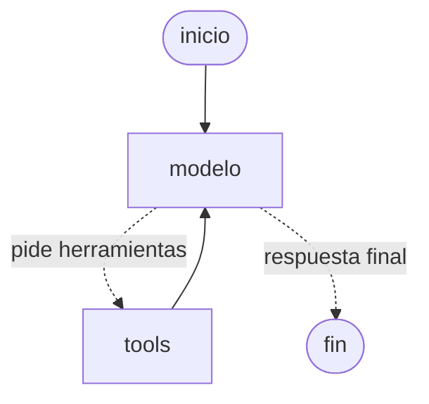

# Agente LangGraph de ejemplo

Agente conversacional construido con [LangGraph](https://langchain-ai.github.io/langgraph/) y Claude (vía `langchain-anthropic`). Implementa el patrón **ReAct**: el modelo decide si responde directamente o si llama a una herramienta, recibe el resultado y vuelve a razonar.

## Estructura

```
agente-langgraph/
├── agent.py           # Herramientas, grafo y loop de chat por consola
├── requirements.txt   # Dependencias con versiones fijadas
├── .env.example       # Plantilla de variables de entorno
└── .gitignore
```

## Cómo funciona el grafo



- **Estado**: `MessagesState`, una lista de mensajes que se va acumulando.
- **Nodo `modelo`**: llama a Claude con las herramientas enlazadas (`bind_tools`).
- **Nodo `tools`**: `ToolNode` ejecuta las herramientas que pidió el modelo.
- **Arista condicional**: `tools_condition` enruta a `tools` si hay llamadas a herramientas, o termina si no.
- **Memoria**: `MemorySaver` guarda la conversación por `thread_id`, así el agente recuerda los turnos anteriores.

Herramientas incluidas:

| Herramienta   | Qué hace                                                        |
|---------------|-----------------------------------------------------------------|
| `calcular`    | Evalúa expresiones aritméticas de forma segura (sin `eval`).    |
| `hora_actual` | Devuelve fecha y hora en una zona horaria IANA.                 |

## Instalación

Requiere Python 3.10+.

```powershell
cd agente-langgraph
python -m venv .venv
.\.venv\Scripts\Activate.ps1        # En Linux/macOS: source .venv/bin/activate
pip install -r requirements.txt
```

> El entorno virtual `.venv` ya viene creado y con las dependencias instaladas; solo hace falta activarlo.

## Configuración

Copiá `.env.example` a `.env` y completá tu API key de Anthropic:

```powershell
Copy-Item .env.example .env
```

```
ANTHROPIC_API_KEY=sk-ant-...
MODEL=claude-sonnet-5   # opcional
```

## Uso

```powershell
python agent.py
```

Ejemplo de sesión:

```
Vos: ¿Cuánto es (12 + 8) * 3 / 4?
Agente: El resultado es 15.

Vos: ¿Qué hora es en Madrid?
Agente: En Madrid son las 23:47 del 26 de septiembre de 2026.

Vos: Multiplicá el primer resultado por 10
Agente: 15 × 10 = 150.
```

Escribí `salir` para terminar.

## Cómo extenderlo

1. **Agregar una herramienta**: definí una función con el decorador `@tool` (el docstring es la descripción que ve el modelo) y sumala a la lista `HERRAMIENTAS`.
2. **Cambiar el modelo**: modificá `MODEL` en `.env`.
3. **Persistir la memoria**: reemplazá `MemorySaver` por un checkpointer persistente, como `langgraph-checkpoint-sqlite`.
4. **Visualizar el grafo**: `print(construir_agente().get_graph().draw_mermaid())`.
